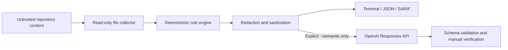

# Threat model

## Security objective

Agent Risk Linter should let a maintainer inspect untrusted agent instruction packages without granting those packages execution authority. Its output should surface likely trust-boundary crossings while avoiding disclosure of credential-like values.

## Assets

- Maintainer and CI credentials.
- Source code and files outside the scanned repository.
- GitHub workflow tokens, secrets, caches, and artifacts.
- Integrity of the scanner's rules, configuration, compiled action, and release package.
- Confidentiality of content optionally submitted for semantic review.

## Adversaries and inputs

- A contributor who submits a malicious Skill, `AGENTS.md`, Codex lifecycle hook, plugin marketplace or manifest, MCP configuration, WebMCP site-tool registration, script, workflow, dependency, or rule change.
- A compromised package, action, release artifact, or upstream repository.
- Prompt injection embedded in issues, comments, webpages, tool output, or documentation.
- A local attacker who can replace configuration, build output, or environment variables before scanning.
- Accidental dangerous instructions written by a trusted contributor.

Every scanned byte is treated as untrusted data. Configuration and compiled `dist/` files are trusted only to the degree that the maintainer reviewed their source and change history.

## Trust boundaries

The normal path ends at local output and performs no network request. The optional API path requires an explicit flag, sends a previewable subset, and treats the response as untrusted analysis.

## Implemented controls

- No runtime dependencies and no target-code execution.
- No symlink traversal.
- Binary, size, and file-count limits.
- Common dependency/build directories excluded.
- Secret redaction before every output channel and API payload.
- Review-oriented detection for Codex lifecycle hooks that automatically execute commands.
- Detection and output redaction for static credential-bearing MCP HTTP headers.
- Detection of mutable Git and npm sources in repository-scoped plugin marketplaces.
- Review-oriented detection for WebMCP tools that expose application capabilities to agents in a live signed-in page session.
- Structured semantic output with file allowlisting and line clamping.
- Static-only GitHub Action, so untrusted PR scanning does not need an API secret.
- Centralized, visible rule suppressions.
- Third-party CI actions pinned to full commit SHAs.
- Unit fixtures are inert and use reserved invalid domains.

## Residual risks

- Regex-based rules can produce false positives, miss obfuscation, or consume excess CPU on adversarial text.
- Unicode confusables, unusual encodings, generated files, large files, and binaries may evade inspection.
- Redaction patterns cannot guarantee removal of every project-specific secret format.
- A malicious change can modify rules, configuration, tests, or committed build output in the same pull request.
- Semantic review transfers selected redacted content to an external API and can return incorrect results.
- SARIF consumers and terminals remain separate software with their own vulnerabilities.

## Maintainer review requirements

- Review rule and suppression changes as security-sensitive.
- Compare source and compiled `dist/` changes before release.
- Run tests, self-scan, CodeQL, and package-content inspection.
- Publish from a protected tag and trusted npm publishing environment.
- Never place production secrets in test fixtures.
- Investigate redaction bypasses privately because reports may contain secret-shaped material.

## Out of scope

- Executing or detonating malware.
- Proving exploitability against systems not owned or authorized by the reporter.
- Automatic remediation, automatic merge, or credential revocation.
- Full application vulnerability, dependency vulnerability, or container scanning.
